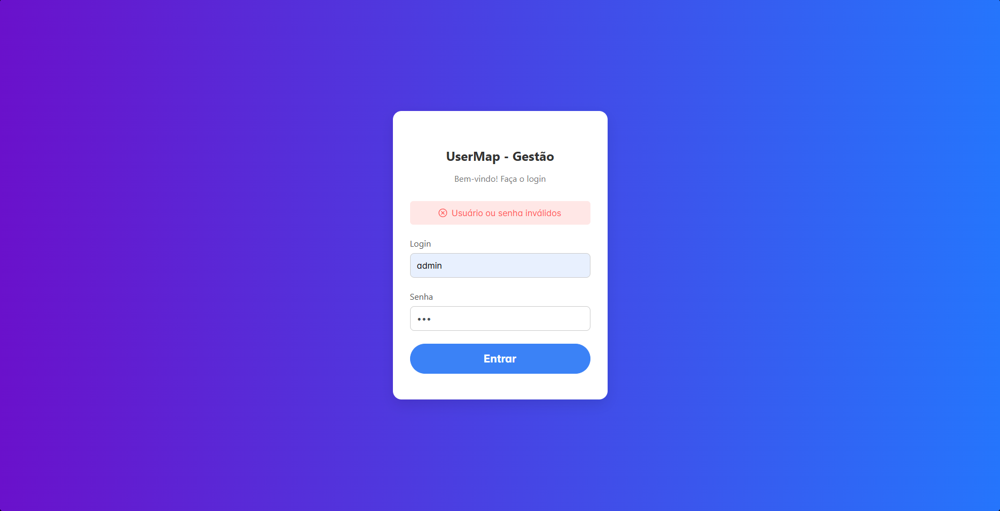
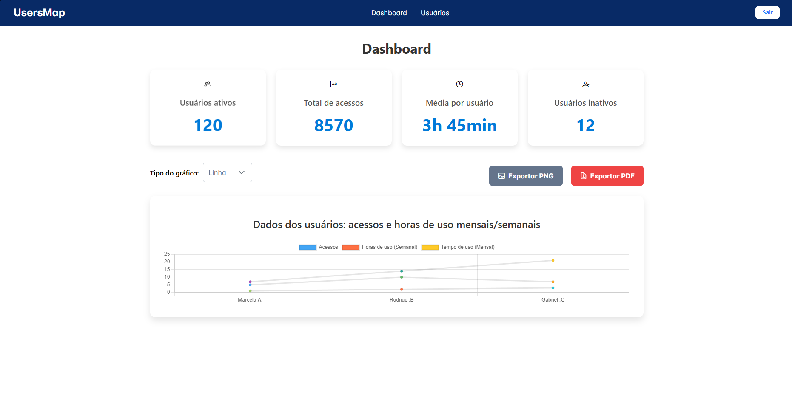
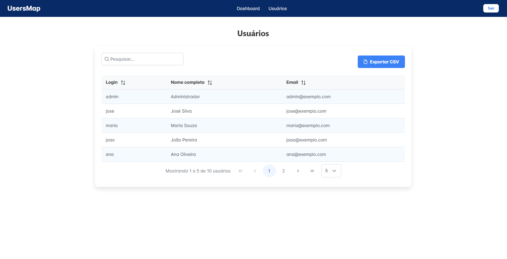

# Resumo: Visão do estado inicial 📋

- Sistema Baseado em Angular e Typescript, com utilização de estilização css e componentes da biblioteca **PRIME NG** (Gráficos, tabelas, botões, inputs, etc.)
- **Login**: Apresenta um sistema de autenticação que utiliza o service "auth.service.ts" para fazer uma requisição que bem sucedida gera um token JWT de autenticação, necessário para acessar via localStorage as outras páginas protegidas pelo "auth.guard.ts"
- **Home**: Basicamente apresenta a ideia de um deshboard, representando as informações sobre usuários.
- **Users**: tela de listagem de usuários, mostrando em tabela o usuário e o email.

**Pontos fortes**:
- Iniciativa de utilização de um sistema de autenticação JWT Via Token, com guard que autentica realmente a segurança nas demais telas,
- Utilização de ferramentas potentes atualmente no mercado para mecanismos de gráficos e tabelas

**Pontos fracos e defeitos**:
- Modularização do projeto básica (Único módulo para controlar tudo)
- Falta de utilização de um service para busca de usuários.
- Massa de dados para utilização muito fraca, não apresenta detalhes ou precisão para criação de indicadores/gráficos
- Aplicação incorreta de estilização, estruturas de template do projeto, arquvios de configuração ausentes.
- Estilização despadronizada, sem alinhamentos e margens.
- Falta da possibilidade de navegação atraves de recursos em tela.

# Correções iniciais 🔧

**Observações**:
Ao descompactar e abrir o projeto pela IDE constatei que haviam estruturas incompletas e problemas, dos quais impossibilitavam a inicialização do projeto

### Situação #1 - Falta das dependências

**Cenário**:

- O projeto foi entregue sem o arquivo package.json;
- Sem esse arquivo, o comando npm install não pode ser executado;
- Pelo motivo acima a pasta node_modules não foi criada, e o Angular CLI não encontrou os arquivos internos necessários (incluindo o schema);

**Solução**:

- Criação manual do arquivo package.json com informações padrão;
- Instalação das dependências com o comando "npm i";

**Erro Apresentado:**

_Arquivo_: angular.json
_Erro_: 
```bash
Unable to load schema from 'c:\Workspace\jwt-auth-angular-v2\node_modules\@angular\cli\lib\config\schema.json': Schema not found: file:///c:/Workspace/jwt-auth-angular-v2/node_modules/@angular/cli/lib/config/schema.json.
```

### Situação #2. Falta da configuração Tsconfig

**Cenário**:

- Não conseguimos encontrar os arquivos de configuração: tsconfig e tsconfig.app;
- Esses arquivos são importantes para interpretar e copilar os códigos presentes em TypeScript;

**Solução**:

- Criação dos arquivos citados acima com definições básicas compatíveis com o projeto.

### Situação #3. Recursos não instalados/arquivos não criados

- O erro apresenta a falta da biblioteca 'Chart.js', então foi necessário instalar com o comando abaixo:
- npm install chart.js
  Error: Can't resolve 'chart.js/auto'

- Em nosso Angular.json configuramos o arquivo "polyfills": "src/polyfills.ts", mas esse arquivo não existe, então foi necessario cria-lo com definições básicas.
  
```bash
File 'src/polyfills.ts' not found
```
- O arquivo styles.css também não estava presente na criação do projeto, sendo assim foi necessário cria-lo, para fazer utilização desse arquivo global/genérico que será importante para definirmos os estilos.
  
```bash
Can't resolve 'src/styles.css'
```
# Melhorias Desenvolvidas 👨‍💻

**Frontend**:

📌Geral:

- Criação de um modulo shared para criação e utilização de componentes úteis em mais de um ponto do projeto.
- Component navbar, com a possibilidade de navegar para as páginas de home e users, além de também poder deslogar o usuário, removendo o token da local storage.
- Criação de um service para coleta dos usuários "user.service.ts";
- Armazenamento da url API em um arquivo de configuração de ambiente
- Utilização de icones da biblioteca primeicons da PrimeNG

📌 Login:

- autenticação do acesso diretamente conectado com o endpoint criado em express;
- Nova estilização e responsividade da tela;
- Envio da senha e username criptografado em base 64 para aumentar a segurança de informações sensíveis;
- Mensagem de validação para caso de login incorreto;
  


📌 Home:

- Transformação da Home em um verdadeiro dashboard, aumentando o foco em apresentar os indicadores e ser intuitivo.
- Recurso para alterar em tempo real o tipo de gráfico desejado (Pizza, Barra, etc.), atravez de um Input de seleção PrimeNg;
- Novos indicadores práticos para visualizar informações importantes como total de acessos, horas acessadas no mês/semana.
- Possibilidade de exportação do gráfico da em PNG ou PDF, em qualquer tipo de gráfico.
  


📌 User:

- Criação de uma tabela utilizando melhor os recursos da PrimeNg como filtros, paginação personalizada, filtros de ordenação e busca por pesquisa;
- Nova estilização com linhas zebradas para facilitar visualização das informações;
- Dados capturados diretamente do endpoint criado em express;
- Exportação csv da tabela de listagem dos usuários;
- Aumento da massa de dados de usuários, apresentando novas informações como Nome Completo;
  


**Backend**:

**Instrodução**
Obs: Estou ciente que a vaga compete a desenvolvedor Frontend, entretanto para trabalhar de forma mais fiel a realidade, criei uma API simples em **Express** consumindo uma base de dados FAKE.

📌 Foram desenvolvidos Enpoints da Api:

- Estrutura para manipular o login gerar o token e devolver na requisição comportando a criptografia
- Estrutura para buscar lista de usuários (base de dados fake)

📌 Instalação do Swagger para documentação e testes das api

- Possibilidade de uso dos endpoints criados e teste via Swagger
  (Documentação no final)

# Melhorias Recomendadas 🚀
1. **Responsividade:** Aprimorar o layout para dispositivos móveis e diferentes resoluções.
2. **Indicadores Avançados**: Implementar métricas mais complexas (usuários inativos, frequência de acesso, análises temporais).
3. **Base de Dados Real**: Substituir a base fake por um banco relacional/NoSQL para persistência real e maior riqueza de dados (ex.: datas de cadastro, histórico de login, perfil detalhado).
4. **CRUD Completo na Tela de Usuários**: Permitir criação, edição e exclusão lógica (soft delete) de usuários, garantindo conformidade com boas práticas de segurança e LGPD.
5. **Autenticação e Segurança**: Evoluir para JWT, implementação de refresh token e roles/permissions para controle de acesso granular.
6. **Organização dos modulos para escalabilidade**: Criar modulos específicos para cada estrutura, página desse modo é possível otimizar o que será importado para uso, evitando importaçãoes desnecessárias.
7. **Implementações de intefaces**: Criar interfaces para formar os objetos com seus devidos tipos, consolidando as estruturas e evitando erros e inconsistências na manipulação dos dados.

# Instalação e execução do projeto 
#### Como rodar localmente a API


```bash
1. Entrar na pasta API: cd .\API
2. Instalar as dependências: 'npm i' ou 'npm install'
3. Iniciar a API com o comando: 'npm run dev'
```
#### Como rodar localmente o projeto angular


```bash
1. Entrar na pasta FRONTEND: cd .\FRONTEND
2. Instalar as dependências: 'npm i' ou 'npm install'
3. Iniciar o projeto com o comando: 'ng Serve'
```
#### Acesso Sistema

- Login: admin
- senha: 1234


# Documentação API
Swagger: http://localhost:5001/api/docs/

### Autenticação do acesso

```http
  POST http://localhost:5001/api/auth
```
**Parametros necessários**: 
- String: Username
- String: Password

### Retorna a lista de usuários

```http
  GET http://localhost:5001/api/users
```

