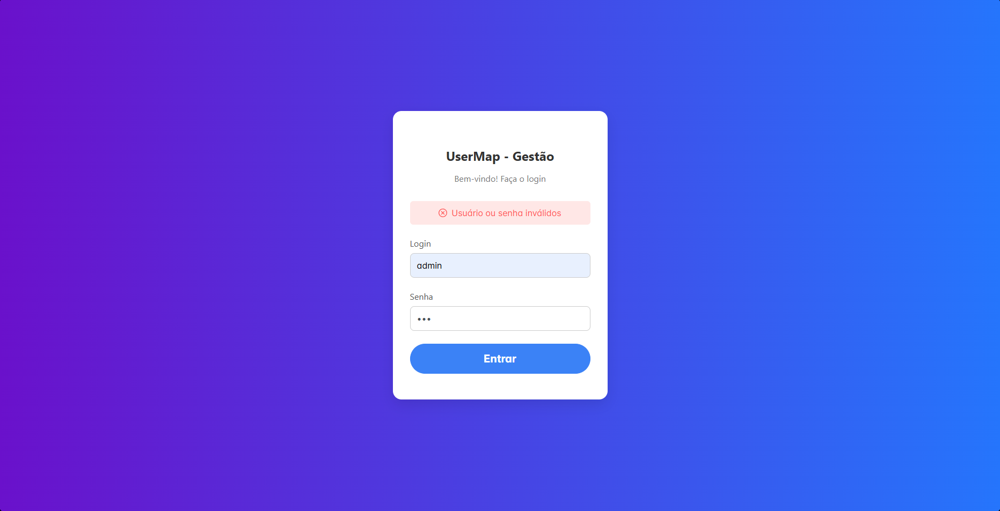
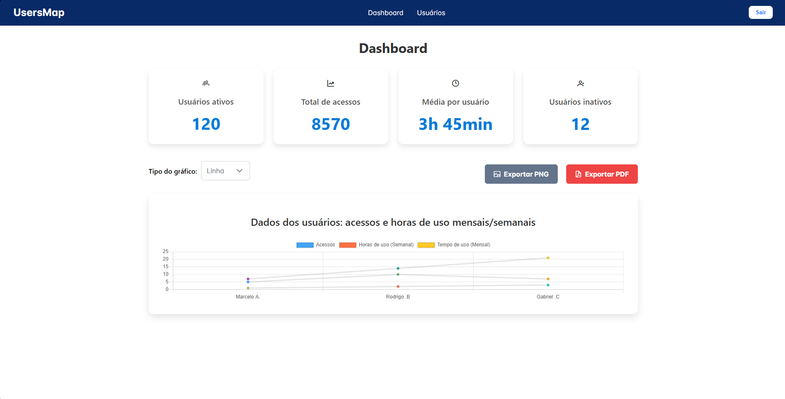
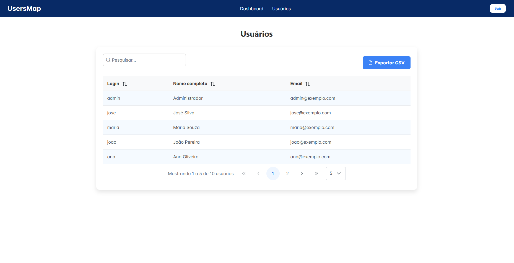

# Angular JWT Authentication Dashboard

A modern **Angular** dashboard application built to demonstrate authentication, data visualization, and user management. The project showcases best practices in **Angular**, **TypeScript**, and **PrimeNG**, while also introducing architectural improvements, reusable components, and a lightweight **Express API** for a realistic full-stack development experience.

The goal was not only to fix an incomplete project but also to refactor its architecture, improve the user interface, and implement features commonly found in production-ready applications.

## 📋 Initial Project Overview

The original project consisted of:

- Angular + TypeScript application.
- CSS styling with **PrimeNG** components (charts, tables, buttons, inputs, etc.).
- JWT-based authentication.
- Dashboard displaying basic user statistics.
- User listing page.

### ✅ Strengths

- JWT authentication with route protection using Angular Guards.
- Good use of PrimeNG components for charts and tables.

### ❌ Weaknesses

- Single-module architecture with poor scalability.
- No dedicated service for user data retrieval.
- Limited dataset, preventing meaningful dashboards and analytics.
- Missing project configuration files.
- Inconsistent styling and layout.
- Lack of reusable components.
- Limited navigation experience.

---

# 🔧 Initial Fixes

During the initial analysis, the project could not even be executed because several essential files were missing.

## 1. Missing Dependencies

### Problem

- `package.json` was missing.
- Dependencies could not be installed.
- Angular CLI failed because `node_modules` was unavailable.

### Solution

- Created a new `package.json`.
- Installed all required dependencies.

### Error

```bash
Unable to load schema from ...
Schema not found
```

---

## 2. Missing TypeScript Configuration

### Problem

The following configuration files were missing:

- tsconfig.json
- tsconfig.app.json

### Solution

Created both files using compatible Angular configurations.

---

## 3. Missing Resources

Several required resources were also absent.

### Installed Chart.js

```bash
npm install chart.js
```

Error:

```bash
Can't resolve 'chart.js/auto'
```

### Created Polyfills

```bash
File 'src/polyfills.ts' not found
```

### Created Global Stylesheet

```bash
Can't resolve 'src/styles.css'
```

---

# 🚀 Implemented Improvements

## Frontend

### 📌 General

- Created a **Shared Module** for reusable components.
- Added a responsive **Navbar** with authentication controls.
- Created a dedicated `user.service.ts`.
- Moved API URL to environment configuration.
- Added PrimeIcons support.

---

## 🔐 Login

Features implemented:

- Authentication integrated with the Express API.
- Completely redesigned responsive UI.
- Base64 encoding for username and password before transmission.
- Login validation and error messages.



---

## 📊 Dashboard

The Home page was redesigned into a real analytics dashboard.

Features include:

- Interactive chart type selector.
- Multiple dashboard indicators.
- Monthly and weekly statistics.
- Export charts as PNG or PDF.



---

## 👥 Users

Implemented a complete data table using PrimeNG.

Features:

- Advanced filtering.
- Sorting.
- Pagination.
- Search.
- CSV export.
- Zebra-striped rows.
- Data loaded directly from the API.
- Expanded user dataset including full names.



---

# ⚙️ Backend

Although the original challenge focused on the frontend, a lightweight **Express.js API** was developed to simulate a real-world application.

## API Features

- JWT authentication endpoint.
- Fake users endpoint.
- REST API architecture.

## Swagger Documentation

Swagger was integrated for testing and documentation.

---

# 💡 Recommended Future Improvements

- Improve mobile responsiveness.
- Add more advanced dashboard metrics.
- Replace the fake database with a real SQL or NoSQL database.
- Implement full CRUD operations for users.
- Add Refresh Token authentication.
- Introduce Role-Based Access Control (RBAC).
- Split the application into feature modules for better scalability.
- Create TypeScript interfaces for all models.
- Improve test coverage using unit and integration tests.

---

# 🛠️ Installation

## Backend

```bash
cd API

npm install

npm run dev
```

---

## Frontend

```bash
cd FRONTEND

npm install

ng serve
```

---

# 🔑 Demo Credentials

**Username**

```text
admin
```

**Password**

```text
1234
```

---

# 📖 API Documentation

Swagger

```text
http://localhost:5001/api/docs/
```

---

## Authentication

```http
POST /api/auth
```

### Request Body

| Field | Type |
|-------|------|
| username | string |
| password | string |

---

## Get Users

```http
GET /api/users
```

Returns the complete user list from the fake database.

---

## 👨‍💻 Author

- Gabriel Campos
